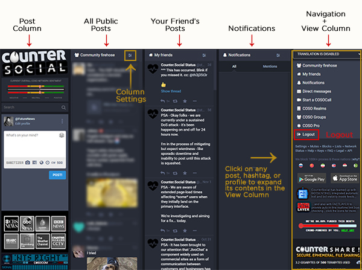
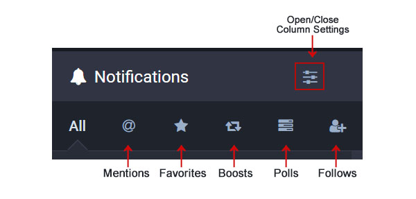

Browsing & Curation
=====

Last Updated: November 9, 2022. 

The Desktop Layout
------------

CounterSocial's (CoSo) layout presents various content in a series of columns. You can have as many or as few columns as you wish and configure each column's settings to your liking. When you first sign up, focus on your attention on the "Community Firehose" column. This is everyone's public post and a great place to get familiar with the layout while exploring features. If you have questions, simply create a post and include the #help hastag and a member of the community will guide you. 

.. tip:: Visit your preferences to enable "Ostrich Mode" for a more minimal desktop layout. This mode will remove the "extras" including the news ticker, CoSoCom emergency radio scanner, and live news station feeds. You can also adust your browser width to thin to force a one-column mobile-reponsive layout. 

For an expanded, in-depth overview of the destop layout, visit CoSo user @MLClark's `article on OnlySky Media <https://onlysky.media/mclark/countersocial-isnt-the-new-twitter-its-something-way-better/>`_.

| 
| 
Navigation + Content Viewer Column
------------

When you click on any profile name, hashtag, or post, contents will automatically override the right navigation column, giving you an expanded view of the contents including threads, post replies, hashtag feeds, and full user profiles. When you are done, click the "Back" button at the top to return home to the navigation column. You can reset this column at anytime by clicking the G and S keys at the same time, or by clicking the Counter Social logo. 

| 
| 
Notitifications Column & Setting
------------

The Notification column is identified with a bell icon and the word *Notifications*. Click on the mixer icon at the top right of the column to open it's settings. The header includes some icons for filtering the list of posts that appear in the column. 

  **All** - this is the default view and this shows every one of the new messages to your @handle, replies to, favorites and boosts of your posts.

  **Mentions** - The “at symbol” shows posts wherein your @handle was specifically included. This could be replies or new messages calling for your attention.

  **Boosts** - The double headed square arrow BOOSTS  an existing post. This mimics the other platforms’  Retweet or Share buttons. Like the star, no counting takes place. 

  **Poll Reactions** - Polls in which you voted, as well as new polls started by your friends will show up here.

  **Follows** - Click the person to see a list of all the people who are following you. 

To adjust your Notification Settings, click the Mixer icon in the top right corner of the column to open or close the list of options for customizing your notifcations. You might want to experiment to see what gives you the best experience; it will be different for each user. 

  **Quick Filter Bar** - this displays the icons described above, or not if you prefer.

  **Push Notifications** - CounterSocial integrates with the internal notification systems of most browsers. If your desktop browser offers this function, you will be  prompted to accept or decline this feature at start-up. This feature is disabled on mobile devices by default. 

  **New Followers & Favorites** - Display options that react to others choosing to follow you. 

| 
| 
How to Add or Remove Columns
------------

.. image:: img_columnsettings.jpg
| 
| 
| 
| 
| IN PRODUCTION - Writer: Bluesbaby
| 
| 
| 
| 

How to Filter Content
------------
| 
| 
| 
| 
| IN PRODUCTION - Writer: Bluesbaby/Phase
| 
| 
| 
| 

How to Follow Users
------------
| 
| 
| 
| 
| IN PRODUCTION - Writer: Bluesbaby
| 
| 
| 
| 

How to Create & Manage Lists
------------
| 
| 
| 
| 
| IN PRODUCTION - Writer: Bluesbaby
| 
| 
| 
| 

How Mute & Block Users
------------
| 
| 
| 
| 
| IN PRODUCTION - Writer: Bluesbaby
| 
| 
| 
| 

How to Mute Hashtags & Keywords (New)
------------
| 
| 
| 
| 
| IN PRODUCTION - Writer: Bluesbaby/Phase
| 
| 
| 
| 
.. attention:: Have questions or need help? Follow @CoSoTips or tag any post with #help to get support from the community. 
