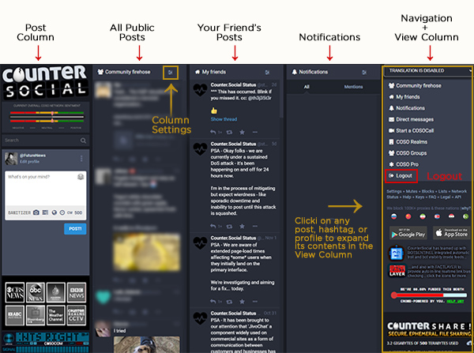
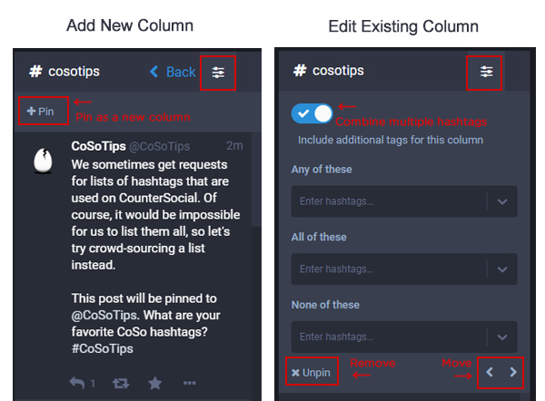
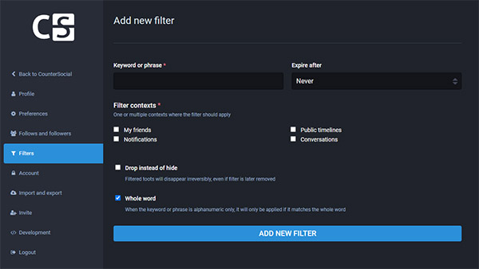

Browsing & Curation
=====

Last Updated: November 9, 2022. 

The Desktop Layout
------------

CounterSocial's (CoSo) layout presents various content in a series of columns. You can have as many or as few columns as you wish and configure each column's settings to your liking. When you first sign up, focus on your attention on the "Community Firehose" column. This is everyone's public post and a great place to get familiar with the layout while exploring features. If you have questions, simply create a post and include the #help hastag and a member of the community will guide you. 

For an expanded, in-depth overview of the destop layout, visit CoSo user @MLClark's `article on OnlySky Media <https://onlysky.media/mclark/countersocial-isnt-the-new-twitter-its-something-way-better/>`_.

.. tip:: Visit your preferences to enable "Ostrich Mode" for a more minimal desktop layout. This mode will remove the "extras" including the news ticker, CoSoCom emergency radio scanner, and live news station feeds. You can also adust your browser width to thin to force a one-column mobile-reponsive layout. 

Navigation + View Column
------------

When you click on any profile name, hashtag, or post, contents will automatically override the right navigation column, giving you an expanded view of the contents including threads, post replies, hashtag feeds, and full user profiles. When you are done, click the "Back" button at the top to return home to the navigation column. You can reset this column at anytime by clicking the G and S keys at the same time, or by clicking the Counter Social logo. 

Notifications
------------

The Notification column is identified with a bell icon and the word *Notifications*. To configure your notifcation settings settings, click the mixer icon in the top right corner of the column. From here, you can set options for your *Quick Filter* bar, turn on/off prompts for desktop notifications if your browser offers this function. This feature is disabled on mobile devices by default. 

The header also includes some icons for filtering the list of notifications that appear in the column. 

.. image:: img_noticolumn.jpg

**All** - this is the default view and this shows every one of the new messages to your @handle, replies to, favorites and boosts of your posts.

**Mentions** - The “at symbol” shows posts wherein your @handle was specifically included. This could be replies or new messages calling for your attention.

**Favorites** - The star is for the posts that others (or you) marked as a favorite. It is similar to the Like button seen on other platforms, however there is no counting of the number of times a post has been marked as a favorite. This is not a competition sport.

**Boosts** - The double headed square arrow BOOSTS  an existing post. This mimics the other platforms’  Retweet or Share buttons. Like the star, no counting takes place. 

**Poll Reactions** - Polls in which you voted, as well as new polls started by your friends will show up here.

**Follows** - Click the person to see a list of all the people who are following you. 

Add or Remove Columns
------------

Are there topics that you want to see all the time? You can pin your favourite hashtags into new columns if you're on the desktop app.

Use Search to find a hashtag or click any hashtag in a post. All the posts using that hashtag appear in the far-right column. 

From there, click on the sliders icon, and pin the hashtag to a new column. Once you have a new column, you can open the slider and add as many hashtags as you'd like. You can also specify hashtags to omit. We have all the tools to curate your experience here.

To position the column, open the slider icon and use the < >. To remove a column, open the slider icon and select Unpin.

Content Filters
------------

If there are topics that you'd prefer never to see, we have Filters on the desktop app. Go to the Edit Profile link at the top of your profile page or above the Post box. Select Filters.

To create filters, you'll need to configure one word, term, or phrase per entry. You can also uncheck "whole word" to catch more items with singular filters. For example, if you used partial word filtering on "vote," you wouldn't see posts about people expressing how devoted they are to #catsofcoso. 

Following Users
------------
You're free to follow whomever you'd like. Click on any user name, and their profile appears in the far-right column on the desktop. Select the Follow button, and their posts load in your Friends column.

You can also Search for users and favourite hashtags. Don't worry if it tells you that hashtags don't have posts, just tap on the hashtag to see what's there and who is posting.

Lists
------------
Set up custom lists to ensure you never miss what your favourite followers post. Select Lists in the far-right column on the desktop or under the slider on the mobile app. Enter a New List Title. Then select the title just created and open the slider icon in the top right. Select Edit list and add @names of people you follow.

Or, you can add people to your List from their Profile page. Click the menu (three dots) and select Add or Remove from Lists.

Mute & Block Users
------------
On CounterSocial, you are encouraged to mute or block people without hesitation if they are annoying you for any reason. Click the three dots at the bottom on any post and select Mute or Block.

When Muting, all Notifications from that user are hidden. If you uncheck Hide Notifications from this user, any interactions (Likes, Boosts, Comments) still appear in your Notifications column.

You can always Unmute or Unblock followers. Select Mutes or Blocks in the far-right column on the desktop or under the slider on the mobile app.

 |
 |
.. attention:: Have questions or need help? Follow @CoSoTips or tag any post with #help to get support from the community. 