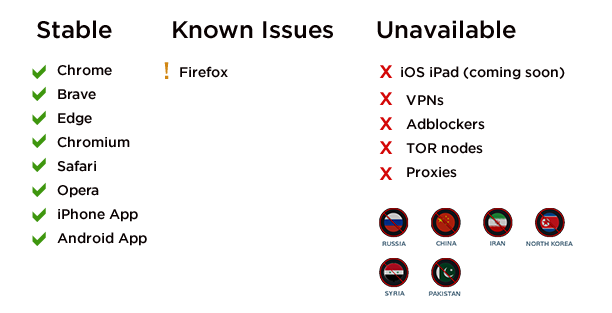
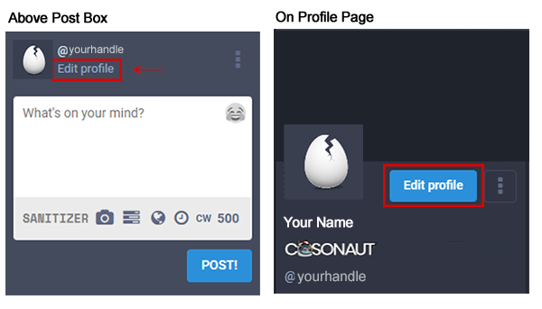
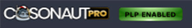

Getting Started
=====

Requirements
------------
Counter.Social is accessible using all modern web browsers and via the official CoSo mobile apps for both iPhone and Android devices. iPad users can access the platform via the device's web browser. The platform is currently unavailable to users located in Russia, China, Iran, Syria, and North Korea, as well as those arriving via VPN, TOR, or proxy. Please whitelist Counter.Social or disable with any adblockers, sheilds, or VPN tunneling.

Creating Your Account
------------
Your username and email are fixed and can not be changed following account activiation. This is a security feature to prevent bots and trolls from manipulating the platform. Should you wish to change your Username, you will need to delete your account and create another using a unique email address. Please choose wisely. 

Following sign-up, you will receive an email from Counter.Social with instructions on activating your account. 

**To sign up for a free account visit:**

| Desktop/Browser Version: https://counter.social
| Mobile App Downloads: https://smarturl.it/countersocialapp

Setting Up Your Profile
------------
 
You can find all prefererences and settings by clicking on the "Edit Profile" link found above the post post in the left column or on the top of your profile page. 

**Display Name** - While your @handle is fixed and unchangeable, you may update your Display Name at any time. 

**Bio** - Write a short descriptoin of yourself to display on top of your profile page. The character limit is 500. Feel free to include hashtags that define your professions, interests, or group memberships so other users with similar interests can find you.

**Header** - Your header image is the banner that appears on top of your profile page when your screen name or display name are clicked. Please upload a PNG, GIF, or JPG no larger than 2mb. This image will be rescaled to 1500x500px. 

**Avatar** - Your avatar is the photo or image that appears on top of your profile and next to your post. The current default is a cracked egg. Uncrack it now by uploading a PNG, GIF, or JPG image no larger than 2mb in size. Your image will be resized to 85x85 pixels. Square images are preferred.

 

Configuring Your Preferences
------------
After you have set up your personal profile, use the field below the profile image uploader to set up the following preferences:

**Publick Landing Page** - CoSo is private by default. This means that your profile and posts are unavailable outside of counter.social and are not index by  3rd party search enginges. Upgrade to PRO to unlock the ability to make your landing page public and sharable with people outside of Counter.Social. PRO users can enable this through the Public Landing Page section found in Profile --> Appearance. Your public share link will be visible below the settings box.

Once enabled, a badge will appear on your profile page letting users know you are open to having your content linked to on 3rd party sites. 

**Lock Account** - Check the box to make your profile private all CoSo Users except those you have accepted as friends. If this box is checked, you will need to manually approve all friend requests. These will appear in your notifications column. 

**Directory Listing - Coming Soon** - While the Directory is currently in development, select this box to be included in a searchable index of Counter.Social users. If you have included hashtags in your bio, your profile will be listed in each respective hashtag group. 

**Profile Metadata** - CoSo allows you to display up to 4 links in a table at the top of your bio. These links can include your website, other social media sites, newspaper/blog, or even non-link data. A verification method is provided to insure that the links you have entered are indeed sites you control. This feature prevents abusers from impersonating others or using CoSo for phishing campaigns. If you would like to verify your links and need help, simply create a post on counter.social and use the #help hashtag. 

