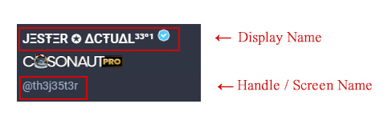
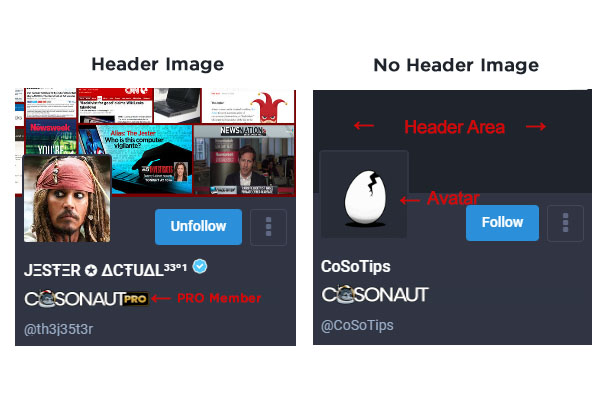
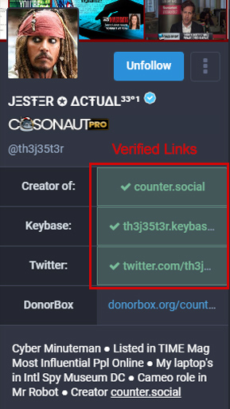

Getting Started
===== 

.. note:: Last Updated November 9, 2022 

Requirements
------------
Counter.Social is accessible using all modern web browsers or via the official CounterSocial (CoSo) mobile apps for both iPhone and Android devices. iPad users can access the platform via the device’s web browser. The platform is currently unavailable to users located in Russia, China, Iran, Syria, and North Korea, as well as those arriving via VPN, TOR, or proxy. ( `Why? <https://counter.social/faq.html/>`_ ) Please whitelist Counter.Social or disable any ad blockers, shields, or VPN tunneling through your browser or device.

.. image:: img_devicestatus.png

| 
|  
Creating Your Account
------------

**To sign up for a free account visit:**

| Desktop/Browser Version: https://counter.social
| Mobile App Downloads: https://smarturl.it/countersocialapp

Your username and email are fixed and cannot be changed following account activation. This is a security feature to prevent bots and trolls from manipulating the platform. The ONLY way to change your Username is to delete your account and create another using a new and unique email address.

Following sign-up, you will receive an email from Counter.Social with instructions on activating your account.

| 
|  
Setting Up Your Profile
------------
 
You can find all preferences and settings by clicking on the “Edit Profile” link found at the top of your profile page. 

.. image:: img_editprofile.png

.. note:: Remember to scroll to the bottom of the page and hit the SAVE button after making any changes.

Display Name
^^^^^^^^^^^^^
While your @handle is fixed and unchangeable, you may update your Display Name at any time. The character limit is 24. In the example below, JΞSŦΞR ✪ ΔCŦUΔL³³°¹ is the Display Name and @th3j35t3r is their handle or "screen name." 

Other than badges and a blue check to denote PRO members, CounterSocial does not grant special status or symbols to individual accounts. Users are free to include symbols in their Display Names and the Emoji library is available to all users.  Country flags, checks marks (of any color!;-)) or others as your imagination dictates. 

Here’s how: 

#. In the text area, click on Insert Emoji (symbol) to reveal the list of system and custom emojis.
#. Scroll through them and find something snazzy.
#. Tap to enter one (or more) into the text area.
#. Copy the symbol(s) and go immediately to Edit Profile.
#. Click “yes” if a pop up asks if you want to Leave site? and  continue to the Edit profile area.
#. Paste the symbol(s) in the Display Name and/or Bio fields.
#. Scroll down and click Save Changes before returning to Counter.Social.

Bio
^^^^^^^^^^^^^
Write a short description of yourself to display on top of your profile page. The character limit is 500. Feel free to include hashtags that define your professions, interests, or group memberships so others can find you when searched.

Header
^^^^^^^^^^^^^
Your header image is the banner that appears on top of your profile page when your screen name or display name are clicked. Please upload a PNG, GIF, or JPG no larger than 2mb. This image will be rescaled to 1500x500px.

These examples show profiles with and without a header:

Avatar
^^^^^^^^^^^^^
Your avatar is the photo or image that appears on top of your profile and next to your post. The current default is an egg.  Uncrack it now by uploading a PNG, GIF, or JPG image no larger than 2mb in size. Your image will be resized to 85x85 pixels. Square images are preferred.

| 
|  
Configuring Your Preferences
------------
After you have set up your personal profile, use the field below the profile image uploader to set up the following preferences:

Public Landing Page (PLP)
^^^^^^^^^^^^^
CoSo is private by default. This means that your profile and posts are unavailable outside of Counter.Social and are not index by 3rd party search engines. 

A PRO account Upgrade will provide a public landing page that is sharable with people outside of Counter.Social.  PRO users can enable this through the Public Landing Page section found in Profile –> Appearance. Your public share link will be visible below the settings box. Once enabled, a badge will appear on your profile page letting users know you are open to having your content linked to on 3rd party sites.

.. image:: img_plpenabled.jpg

Lock Account
^^^^^^^^^^^^^
Check the box to make your profile private all CoSo Users except those you have accepted as friends. If this box is checked, you will need to manually approve all friend requests. Follow requests appear on your profile page. Click the 3 dots to the right of your Display Name for a flyout menu and choose Follow Requests to see who is asking. You can click through to their profiles before choosing to accept or reject the request. No harm no foul, follower counts are not worth a hill of beans here.

Directory Listing (Coming Soon)
^^^^^^^^^^^^^
While the Directory is currently in development, select this box to be included in a searchable index of Counter.Social users. If you have included hashtags in your bio, your profile will be listed in each respective hashtag group.

Profile Metadata
^^^^^^^^^^^^^
CoSo allows you to display up to 4 items in a table at the top of your bio. You can use these fields to display your location, pronouns, website/social links, or labels.

If including links, a verification method is provided to be sure that the links you have entered are indeed sites you control. This feature prevents abusers from impersonating others or using CoSo for phishing campaigns. If you would like to verify your links and need help, simply create a post on counter.social and use the #help hashtag.

| 
| 
.. attention:: Need help? Write a post and include the #help hashtag for support from the community. 
