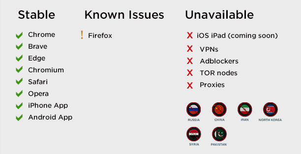
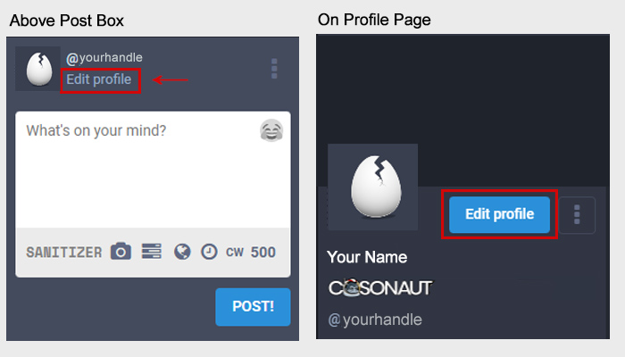

Getting Started
=====

Requirements
------------
Counter.Social is accessible using all modern web browsers and via the official CoSo mobile apps for both iPhone and Android devices. iPad users can access the platform via the device's web browser. The platform is currently unavailable to users located in Russia, China, Iran, Syria, and North Korea, as well as those arriving via VPN, TOR, or proxy. Please whitelist Counter.Social or disable with any adblockers, sheilds, or VPN tunneling.

Creating Your Account
------------
Your username and email are fixed and can not be changed following account activiation. This is a security feature to prevent bots and trolls from manipulating the platform. Should you wish to change your Username, you will need to delete your account and create another using a unique email address. Please choose wisely. 

Following sign-up, you will receive an email from Counter.Social with instructions on activating your account. 

**To sign up for a free account visit:**

| Desktop/Browser Version: https://counter.social
| Mobile App Downloads: https://smarturl.it/countersocialapp

Setting Up Your Profile
------------
 
You can find all prefererences and settings by clicking on the "Edit Profile" link found above the post post in the left column or on the top of your profile page. 

**Display Name** - While your @handle is fixed and unchangeable, you may update your Display Name at any time. 

**Bio** - Write a short descriptoin of yourself to display on top of your profile page. The character limit is 500.

**Header** - Your header image is the banner that appears on top of your profile page when your screen name or display name are clicked. Please upload a PNG, GIF, or JPG no larger than 2mb. This image will be rescaled to 1500x500px. 

**Avatar** - Your avatar is the photo or image that appears on top of your profile and next to your post. The current default is a cracked egg. Uncrack it now by uploading a PNG, GIF, or JPG image no larger than 2mb in size. Your image will be resized to 85x85 pixels. Square images are preferred.

 

Configuring Your Preferences
------------
**Publick Landing Page** - CoSo is private by default. Upgrade to PRO to unlock the ability to make your landing page public and sharable with people outside of Counter.Social. PRO users can enable this through the Public Landing Page section found in Profile --> Appearance. Your public link will be visible below the settings box.

**Lock Account** -

**Directory Listing** - 

**Profile Metadata** - 

