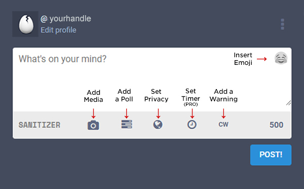
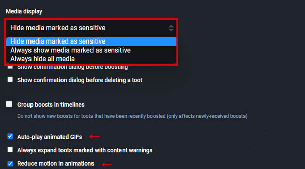
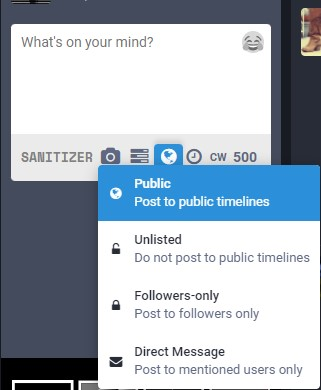
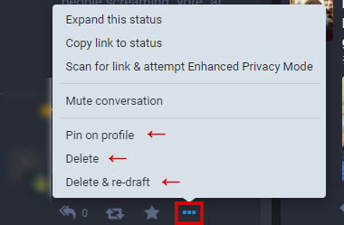

Posting Content
=====

.. note:: Last Updated: November 9, 2022. 

The Post Box
------------

The Post Box is in the left column on desktop version or by pressing the blue pencil icon on the bottom right corner of your mobile device. The default character limit for text posts is 500 characters and can include links, hashtags, polls, content warnings, and emojis. PRO users can adjust privacy at the post level, as well as set an expiration date for a post to expire and self-destruct.

| 
| 
Links & Link Sanitizer
------------
CounterSocial (CoSo) doesn’t track its users, but even better than that - we don’t let 3rd parties track you either. All outbound links are automagically sanitized to remove any embedded tracking parameters. In the case where this impacts your link’s functionality, type nosanitize anywhere in your post to turn off this feature. The most common case for this is time-stamped YouTube videos.

Once posted, the platform will automatically pull up the link preview content including news headlines, article card images, and/or functional media players such as YouTube, Bandcamp, Soundcloud, and Spotify. These link previews are generated the first time your link is clicked or the next time you refresh your feed.

| 
| 
Hashtags
------------
To make your posts more searchable and discoverable by other users, add a hashtag by prepending a keyword with the pound (#) symbol. As you type, you will see suggested hashtags already in use below the post box. CounterSocial is hashtrag-driven with many users configuring their feeds to only display the hashtags and keywords they are interested in, or by using filters to omit this content from their views.

`Click Here <https://coso-userguide.readthedocs.io/en/latest/popular-hashtags.html>`_ for a list of the most commonly used hashtags.

Counter.Social (CoSo) was originally an instance on the Mastodon network where multiple communities shared a central “Community Firehose.” During this time, CoSo users would often prepend hashtags with #CoSo to differentiate between our community and others. You will find these hashtags are still popular today.  

| 
| 
Attaching Media & Files
------------
Click on the camera icon to attach photos, animated GIFs, or videos to your post. On the desktop version, you can also drag-and-drop the media file to the post box to auto-upload. If you would like to share other file types, visit https://share.counter.social/ (also found in the right navigation column) to use CounterSocial’s secure file sharing service, CounterShare (PRO feature).

| 
| 
Media File Types
^^^^^^^^^^^^^

* Images - PNG + JPG images up to 8mb in size. Up to 4 images per post. The post will display a 16:9 preview with the full version opening upon click.
* Animated GIFs - up to 8mb in size. GIFs render as MP4 videos and can also be uploaded 4 at a time, but not in combination with other image formats.
* Videos - MP4, M4V, MOV videos up to 40mb in size and no longer than 1 min in length. Video will be transcoded to H.264 MP4 files upon posting.

.. tip:: CounterSocial automatically scrubs all meta-data from your media files including the date, location, and camera settings. This includes photo orientation. If you upload an image and it is upside down or on its side, delete it from your draft (or delete & redraft the post if already launched), then make an inconsequential edit to your original file, save it, and reupload.  

| 
| 
Editing Media
^^^^^^^^^^^^^
Once attached, hover over the image thumbnail and click the “Change Preview” link to adjust the image preview and add a text description for the visually impaired. This description appears for users accessing Counter.Social via a screen reader or other similar technology.

.. warning:: If your image, GIF, or video is NSWF, contains mature, adult or graphic content, or may negatively impact those with PTSD or photosensitivity issues, please click the eye icon to mark your media as sensitive, and/or add a content warning to your post. Be advised, CounterSocial is committed to providing NO SAFE HAVEN for Child Sex Abuse Material. All uploaded images are hashed and compared against NCMEC databases of known CSAM hashes at our infrastructure edge. 

| 
| 
Setting Your Media Preferences
^^^^^^^^^^^^^
Navigate to Edit Profile –> Preferences and scroll to the Media Display section to configure defaults for how you want media to display in your personal feeds. You can automatically hide all media marked as “sensitive,” choose if animated GIFs auto-play or even reduce their motion. 

| 
| 
Post Privacy Settings
------------
Once you have configured your post, PRO users can set the privacy at the post draft level including unlisted, private, and direct message posting. PRO users can also visit Edit Profile --> Preferences to set the default privacy level for all future posts. 

**Public** - Posts appear in the community firehose, your friend’s timelines, and on your profile page. If your `Public Landing Page <https://coso-userguide.readthedocs.io/en/latest/getting-started.html#public-landing-page-plp>`_  is enabled, these posts are visible to the general public and are indexed by search engines. This is the default setting for regular users. 

**Unlisted (PRO Feature)** - Same as Public posts, but do not appear in the community firehose. The most common use case for this is when creating public posts visible on your Public Land Page without it entering the primary community feed. 

**Followers-Only (PRO Feature)** - Visible to only users that follow you and anyone that is mentioned in the post. These posts cannot be boosted, except by yourself. 

**Direct Message (PRO Feature)** - Visible to only the user who is mentioned (@) in the post. The recipient will receive a notification. All DMs are encrypted and cannot be accessed by any other party, including Jester, unless they are mentioned. Initiating a DM is a PRO feature, and eliminates DM spam, scams, and phishing attempts. Recipients of DMs do not need to be a PRO account. In the case where you are a regular user and wish to have a private conversation with a PRO user, you can ask them to initiate the DM from their side. 

| 
| 
Editing Existing Posts
------------
Rejoice! A version of the “edit” button has arrived. After you have posted, if you need to make changes to your post, click the three dots in the bottom right corner and select “Delete & Re-draft” to make changes and repost. Keep in mind, all boosts and favorites will be reset (deleted) and any original replies will not be linked to the new version. For instructions on editing a photo to change its orientation, see the `Editing Media <https://coso-userguide.readthedocs.io/en/latest/posting-content.html#editing-media>`_ section, above.

You can also delete the post completely, or select “Pin on Profile” to make it sticky at the top of your Profile page. You may have up to 5 pinned posts on your profile.

| 
| 
.. attention:: Have questions or need help? Follow @CoSoTips or tag any post with #help to get support from the community. 
