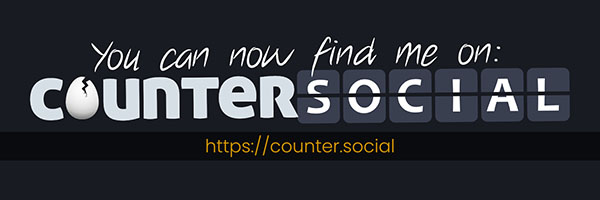

Promoting CoSo
=====

Welcoming New Users
------------

If you are a new user, by the time you finish reading this, your notifications column may have already filling up with messages. No, these are not bots. These are existing members of the community making sure you feel welcome. This "welcome wagon" not only serves the purpose of onboarding new users, but also helps crowdsource the review of all new accounts for use of hate speech in usernames, profile photos, and imagery. It's also the perfect icebreaker for meeting new friends. 

While the custom has become a proud tradition and testiment to the Community's committment to fostering a healthier online space, keep in mind that new useres are just arriving an need time to acclimate. Keep it short, friendly, and geniune. 

**Here are some example greetings to help you find your own voice:**

| "Hi! Welcome. "
| 
| "Welcome to CoSo. If you need help, ask away. Everyone's friendly."
| 
| "Welcome. Visit @CoSoTips for the user guide and FAQs." 

Promoting Your Account on Other Sites
------------

Have you joined us from another platform, but aren't quite sure how to tell your people where you've gone? If so, we have just the thing for you! Download the social media banners to use on Twitter, Facebook, Instagram, or any other social media sites that accept profile photos and headers. If you would like to post a link to your profile on CoSo, activate your `Public Landing Page <https://coso-userguide.readthedocs.io/en/latest/getting-started.html#public-landing-page-plp/>`_ (PRO feature) in your preferences to recieve your unique profile link. 

**Social Media Banners + Avatars**

| **Download Profile Picture**: https://share.counter.social/s/11ea40
| **Download Header**: https://share.counter.social/s/d582f0

CoSo Media Assets
------------

**Logos & Icons**

.. image:: img_graphics.jpg

**Download Graphics (ZIP)**:  https://share.counter.social/s/76ccb4

Press Requests
------------

For interviews or feature requests please email: Press(@)counter.social and include your name, publication, and links to previous published stories for consideration. 
