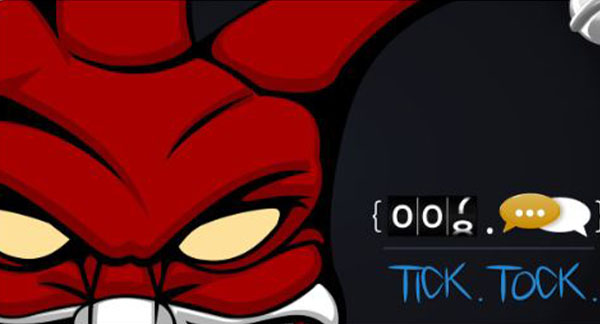
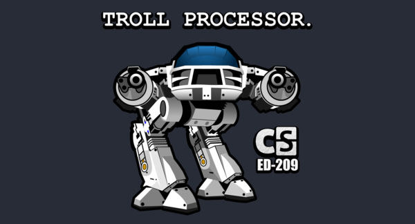
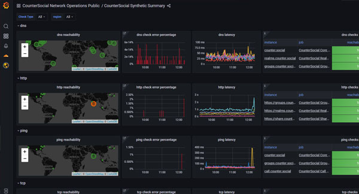

Transparency
=====
Last Updated: November 9, 2022. 

Who is Jester?
------------

Th3J3st3r is a prolific hacktivist and the creator of Counter.Social. He is listed in TIME Magazine’s Most Influential People Online, and his laptop is exhibited in the International Spy Museum in Washington, DC. His alleged escapades were described in articles and programs by NBC, Homeland Security Today, Gizmodo, Newsweek, Tech Insider, and the Larry King Show. Some may have noticed his cameo role in the USA Network TV show, Mr. Robot.

Visit https://counter.social/whojay.html for more info. 

Policy on Trolls & Abuse
------------

CounterSocial takes a zero-tolerance stance to hostile nations, bot accounts, trolls, provocateurs, and abuse. This includes users participating in gaslighting, baiting, sealioning, and dis/misinformation campaigns. Hate speech is also prohibited. While CoSo will block obvious offenders, tools are provided to mute/block any user or filter any keyword that you find offensive or unwanted in your personal view. 

The CounterSocial Team
------------

CounterSocial does not have any excutives, board of directors, or employees and is operated and managed solely by Jester. The CoSo community self-moderates through a unique structure that surfaces troll, bot, and abuse sightings, escalates support issues, and empowers every user to contribute to the health and safety of the overall platform. 

Funding Sources
----------------

Counter.Social’s funding is provided by Jester as the sole operator of the platform, and supplemented by the community through a PRO subscription tier, a premium which unlocks additional features and functionality. The platform also accepts private donations through Donorbox, Patreon, and direct Bitcoin transfers. These funds pay for server, bandwidth, and software needed to keep Counter.Social running. Funding progress toward the monthly goal is displayed through the meter located in the platform’s Navigation column. There are no investors, stakeholders, or venture capital initiatives funding this project. It is 100% community funded.

Visit https://counter.social/supportcoso.html to support. 

System Performance & Metrics
----------------

Counter.Social (“CoSo”) developed several custom dashboards to provide administrative transparency and offer an at-a-glance view of the System Performance, User Trends, and New Member evolution. CoSo constantly monitors the internet ecosystem to mitigate threats to our community. Jester has developed real-time tools to show us the threats CoSo is up against every second of every day. CoSo Realtime Threat Dashboard shows who is trying to hack and/or infiltrate CoSo, by country of origin, hostname, and username. You can read more about the strategy at https://counter.social/faqs.html

Existing users can access this data anytime at https://netops.counter.social or by clicking the “Network Status” link in the Navigation column.

Relationship to Mastodon
----------------

Counter.Social is a hard fork of the Mastodon network under the Free Software Foundation (FSF) Affero General Public License (AGPL). At this time, we are an independent instance separated from the Mastodon federation. CoSo has its own Terms of Service and additional features installed on separate servers, to supplement Mastodon software with proprietary security and resources, for the health and safety of the community.

Read: `The Short History of CounterSocial and Mastodon <https://countersocial.documize.com/s/c30dhakp0nhtab60utag/countersocial-blog/d/c5piofvuaqg133k3is90/the-short-history-of-countersocial-and-mastodon/>`_

License & Policies
----------------

| Licensing:  https://counter.social/terms.html
| Terms of Service: https://counter.social/license.html
| Privacy Policy: https://counter.social/privacy.html
| DMCA Policy: https://counter.social/dmca.html
| GDPR Policy: https://counter.social/gdpr.html
| CCPA Policy: https://counter.social/ccpa.html

.. attention:: Have questions or need help? Follow @CoSoTips or tag any post with #help to get support from the community. 
